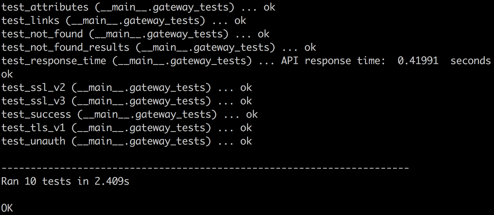

# Terms API Integration Tests

This directory contains files that run integration tests against the Terms API. To run the tests, use Python. These libraries are required to run the integration tests:

* [json](https://docs.python.org/2/library/json.html)
* [requests](http://docs.python-requests.org/en/master/)
* [unittest](https://docs.python.org/2/library/unittest.html)
* [ssl](https://pypi.python.org/pypi/ssl/)
* [urllib2](https://docs.python.org/2/library/urllib2.html)

Use this command to run the tests:

	python integrationtests.py -i /path/to/configuration.json

Any unittest command line arguments should be used before the -i argument. For example, this command will run the tests in verbose mode:
	
	python integrationtests.py -v -i /path/to/configuration.json

Successfully passing all the tests with the command above would output this result:

Note: 'test_not_found' and 'test_not_found_results' will not pass because of a bug with the Terms API. See Jira ticket ECSOPS-61

Python Version: 2.7.10